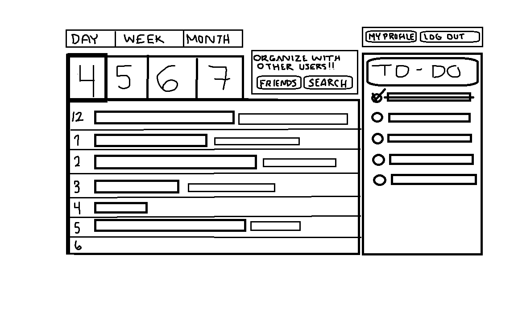
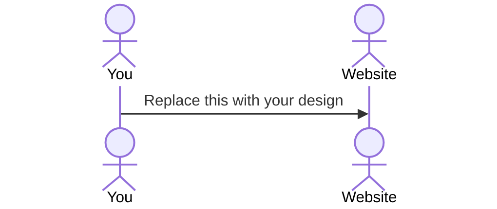

# Daily Planner Startup

[My Notes](notes.md)

This application will act as a daily planner as well as a concise to-do list that is user-friendly and works on either a desktop or a mobile phone. Users will be able to add items to their planner/to-do list with simplicity as well as work with other users to add events to both planners.

> [!NOTE]
>  This is a template for your startup application. You must modify this `README.md` file for each phase of your development. You only need to fill in the section for each deliverable when that deliverable is submitted in Canvas. Without completing the section for a deliverable, the TA will not know what to look for when grading your submission. Feel free to add additional information to each deliverable description, but make sure you at least have the list of rubric items and a description of what you did for each item.

> [!NOTE]
>  If you are not familiar with Markdown then you should review the [documentation](https://docs.github.com/en/get-started/writing-on-github/getting-started-with-writing-and-formatting-on-github/basic-writing-and-formatting-syntax) before continuing.

## 🚀 Specification Deliverable

> [!NOTE]
>  Fill in this sections as the submission artifact for this deliverable. You can refer to this [example](https://github.com/webprogramming260/startup-example/blob/main/README.md) for inspiration.

For this deliverable I did the following. I checked the box `[x]` and added a description for things I completed.

- [X] Proper use of Markdown
- [X] A concise and compelling elevator pitch
- [X] Description of key features
- [X] Description of how you will use each technology
- [X] One or more rough sketches of your application. Images must be embedded in this file using Markdown image references.

### Elevator pitch

As a busy college student juggling multiple classes, I find it can be difficult to organize my day effectively. Remembering all upcoming due dates, projects, homework, and readings is a daunting task, especially without a proper to-do list. Checking multiple sites (i.e. Learning Suite, Canvas, etc.) and multiple class pages just to be reminded that something is indeed due is time consuming and inconvenient. This daily planner design will allow users to input their daily events and upcoming due dates in a more simplified and efficient manner. 

### Design

I want the design to have all of the most important information up front: what needs to be done *now*, what is coming up next, and what have I already accomplished? Different types of tasks or activities will be color coordinated (i.e. different classes, meals, etc.). The users will be able to add and delete tasks with ease as well as being able to coordinate with other users.

### Key features

- **Planner** - Users will be able to choose between adding daily, weekly, or monthly events. Different types of events will be color coordinated.
- **To-Do List** - The To-Do list will organize based on due dates, therefore more important tasks will appear at the top. Users will be able to check off what they have already accomplished, and the task will stay (crossed out) until the end of the day. 
- **Coordination with other users** - Users will be able to organize activities/events that will appear on both calendars. These events will have the name of the other user added to them. 

### Technologies

I am going to use the required technologies in the following ways.

- **HTML** - HTML will be used in this design to build the basic structure of the site. This will allow for users to input their information, events, and tasks. HTML is focused on structure and text more than design, so this will be implemented before any specific design choices.
- **CSS** - CSS works hand in hand with HTML but to modify the appearance of the site and include animations and effects. CSS is especially important in this design as it will allow for users to color coordiante their events. CSS will help guide the users, draw their attention to more important features, and allow for organization of events/tasks. 
- **React** - Building and updating the user interface is necessary for this web design because users will need to be able to easily use the site with little to no confusion. This site will include a login page, multiple pages leading to the daily schedule, weekly schedule, monthly schedule, and a way to add tasks/events. React will allow me to switch between those pages with ease.
- **Service** - This design will implement login, logout, and connecting with other users. Service allows for the backend server functionality of these actions. Most important and possibly the most difficult task will be befriending and organizing with other users, so Service will be much needed to accomplish this.
- **DB/Login** - Database focuses more on storing and rendering data of multiple users on a site. While not all of the data from a user will be available to all other users, some of it will be allowed, which is where DB/Login will be useful. 
- **WebSocket** - WebSocket will be used to implement a function such as chatting between users or requesting to create an event together. WebSocket puts more focus on realtime data rather than long-term stored data, which will be reflected in the interactions between users. 

## 🚀 AWS deliverable

For this deliverable I did the following. I checked the box `[x]` and added a description for things I completed.

- [ ] **Server deployed and accessible with custom domain name** - [My server link](https://yourdomainnamehere.click).

## 🚀 HTML deliverable

For this deliverable I did the following. I checked the box `[x]` and added a description for things I completed.

- [ ] **HTML pages** - I did not complete this part of the deliverable.
- [ ] **Proper HTML element usage** - I did not complete this part of the deliverable.
- [ ] **Links** - I did not complete this part of the deliverable.
- [ ] **Text** - I did not complete this part of the deliverable.
- [ ] **3rd party API placeholder** - I did not complete this part of the deliverable.
- [ ] **Images** - I did not complete this part of the deliverable.
- [ ] **Login placeholder** - I did not complete this part of the deliverable.
- [ ] **DB data placeholder** - I did not complete this part of the deliverable.
- [ ] **WebSocket placeholder** - I did not complete this part of the deliverable.

## 🚀 CSS deliverable

For this deliverable I did the following. I checked the box `[x]` and added a description for things I completed.

- [ ] **Header, footer, and main content body** - I did not complete this part of the deliverable.
- [ ] **Navigation elements** - I did not complete this part of the deliverable.
- [ ] **Responsive to window resizing** - I did not complete this part of the deliverable.
- [ ] **Application elements** - I did not complete this part of the deliverable.
- [ ] **Application text content** - I did not complete this part of the deliverable.
- [ ] **Application images** - I did not complete this part of the deliverable.

## 🚀 React part 1: Routing deliverable

For this deliverable I did the following. I checked the box `[x]` and added a description for things I completed.

- [ ] **Bundled using Vite** - I did not complete this part of the deliverable.
- [ ] **Components** - I did not complete this part of the deliverable.
- [ ] **Router** - I did not complete this part of the deliverable.

## 🚀 React part 2: Reactivity deliverable

For this deliverable I did the following. I checked the box `[x]` and added a description for things I completed.

- [ ] **All functionality implemented or mocked out** - I did not complete this part of the deliverable.
- [ ] **Hooks** - I did not complete this part of the deliverable.

## 🚀 Service deliverable

For this deliverable I did the following. I checked the box `[x]` and added a description for things I completed.

- [ ] **Node.js/Express HTTP service** - I did not complete this part of the deliverable.
- [ ] **Static middleware for frontend** - I did not complete this part of the deliverable.
- [ ] **Calls to third party endpoints** - I did not complete this part of the deliverable.
- [ ] **Backend service endpoints** - I did not complete this part of the deliverable.
- [ ] **Frontend calls service endpoints** - I did not complete this part of the deliverable.
- [ ] **Supports registration, login, logout, and restricted endpoint** - I did not complete this part of the deliverable.

## 🚀 DB deliverable

For this deliverable I did the following. I checked the box `[x]` and added a description for things I completed.

- [ ] **Stores data in MongoDB** - I did not complete this part of the deliverable.
- [ ] **Stores credentials in MongoDB** - I did not complete this part of the deliverable.

## 🚀 WebSocket deliverable

For this deliverable I did the following. I checked the box `[x]` and added a description for things I completed.

- [ ] **Backend listens for WebSocket connection** - I did not complete this part of the deliverable.
- [ ] **Frontend makes WebSocket connection** - I did not complete this part of the deliverable.
- [ ] **Data sent over WebSocket connection** - I did not complete this part of the deliverable.
- [ ] **WebSocket data displayed** - I did not complete this part of the deliverable.
- [ ] **Application is fully functional** - I did not complete this part of the deliverable.
